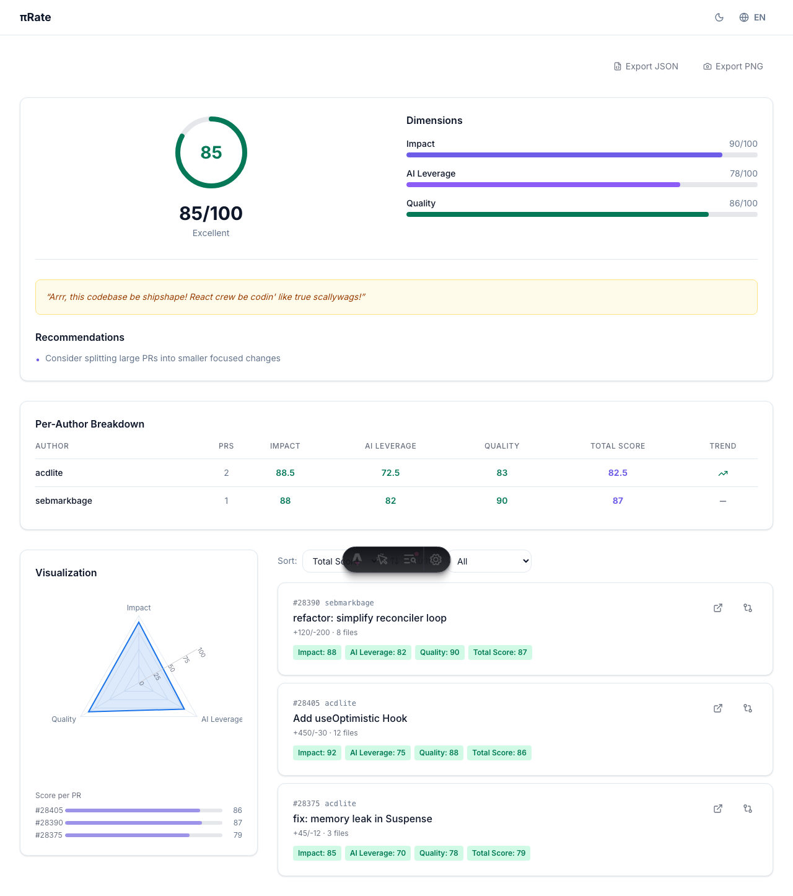
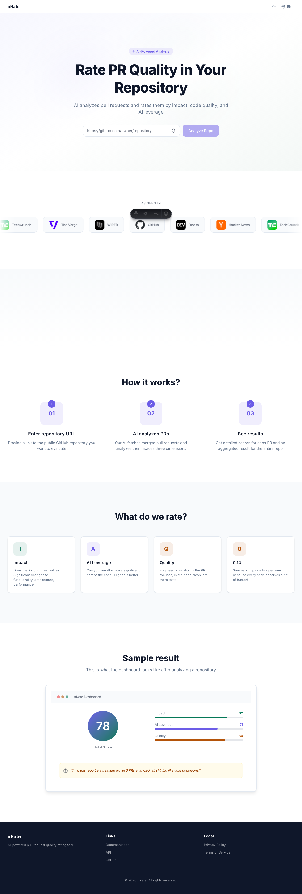

# πRate — AI-powered PR Quality Rating

πRate analyzes pull requests from any public GitHub repo and rates them across three dimensions: **Impact**, **AI-Leverage**, and **Quality**, plus a pirate-themed textual summary (the "0.14" dimension).

---

## 1. How to run locally

```bash
git clone https://github.com/mateusz-spychaj/piRate.git
cd piRate
npm install && npm run dev
```

Optionally copy `.env.example` and set `OPENROUTER_API_KEY` for real AI analysis (without it, mock scores are used).

### Run tests

```bash
npm test          # Unit tests (Vitest)
npm run test:e2e  # E2E tests (Playwright)
npm run test:all  # All tests
npm run typecheck # TypeScript check
```

---

## Preview





---

## 2. Stack & justification

**Astro 6.3** with **React 19 islands**, **Tailwind CSS 4**, **TypeScript strict**, and **Vercel serverless**.

Astro was chosen over Next.js because the landing page needs zero JavaScript — every section (Hero, HowItWorks, ScoringDimensions, Footer) is static HTML/CSS, resulting in a perfect Lighthouse score out of the box. Only the interactive parts (repo input, results dashboard, language switcher) hydrate as React islands. This keeps the initial JS payload under 30 KB. The Vercel adapter provides seamless serverless deployment with automatic function bundling.

---

## 3. How AI was used

The LLM integration uses OpenRouter (configurable via `LLM_MODEL` env var, defaults to `meta-llama/llama-3.1-8b-instruct`) to analyze each merged PR's title, description, and diff metadata. The model returns numeric scores (0–100) for impact, AI-leverage, and quality, which are then weighted into a total score. If the API key is missing or the call fails, the system falls back to deterministic mock scores based on PR characteristics (additions, changed files). The "0.14" dimension (named after π − 3) is a pirate-English summary generated client-side via a rule-based template — no LLM needed.

The project itself was built with the assistance of an AI coding agent (opencode) that implemented the entire codebase across 7 sequential stages, from scaffolding through deployment.

---

## 4. Scoring weight justification

| Dimension | Weight | Rationale |
|-----------|--------|-----------|
| Impact | **40%** | A PR's value to the codebase is the most important signal — does it ship real features, fix critical bugs, or improve architecture? Weighted highest. |
| AI-Leverage | **30%** | Measures how effectively the author uses AI assistance. Important as a modern productivity signal, but not the primary goal of code review. |
| Quality | **30%** | Engineering quality (focused diffs, clean code, tests) is essential but often correlates with impact — weighted equally with AI-leverage to keep the balance. |

The weights sum to 100 %. The 0.14 dimension is not scored — it is a qualitative pirate summary for fun.

---

## 5. Design decisions

- **PR count range 1–10, default 3**: Brief did not specify. 3 is a reasonable sample for a quick overview; the range allows power users to analyze up to 10.
- **In-memory LRU cache (TTL 1h)**: Analysis results are cached server-side to avoid re-fetching from GitHub and re-running LLM calls. On Vercel serverless, the cache is per-instance; client-side sessionStorage and SSR-embedded data provide fallback for same-browser refreshes and shared links.
- **Pirate dimension (0.14)**: Always in Pirate English regardless of UI language. It is a textual summary, not a score — it does not count toward the total.
- **No private repo support**: The brief says "public repos only." We check GitHub API response for 404/403 and surface a clear error message.
- **Language detection**: Default from `navigator.language`, overridable via the header switcher, persisted in `localStorage`. The API accepts a `lang` field to return errors in the user's language.
- **Mock fallback**: Without `OPENROUTER_API_KEY`, the app works fully with mock scores so the UI can be evaluated and tested without an API key.
- **Streaming progress**: The `/api/analyze` endpoint uses SSE (Server-Sent Events) to report per-PR progress, giving real-time feedback during analysis.

---

## 6. What's next (next sprint)

1. **Custom domain** — point `pirate.mateuszspychaj.pl` at Vercel
2. **Private repo auth** — allow users to provide a GitHub token via the UI for private repo analysis
3. **Per-PR diff analysis** — fetch actual diffs and feed them to the LLM for more accurate code-level scoring
4. **Persistent cache** — replace in-memory cache with a Vercel KV (Redis) store so results survive across instances
5. **Export & share** — PDF export of results, shareable report pages (basic version already works via hash URLs)
6. **Rate limiting** — add request throttling per IP to protect the OpenRouter budget
7. **Accessibility audit** — full keyboard navigation pass, screen reader testing

---

## 7. Recording

*Recording link — to be added after screen recording is created.*

---

## 8. Live demo

- **Production** → [https://pirate.mateuszspychaj.pl](https://pirate.mateuszspychaj.pl)
- **Vercel mirror** → [https://pir-rate.vercel.app](https://pir-rate.vercel.app)
